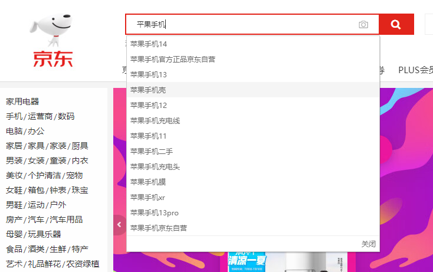
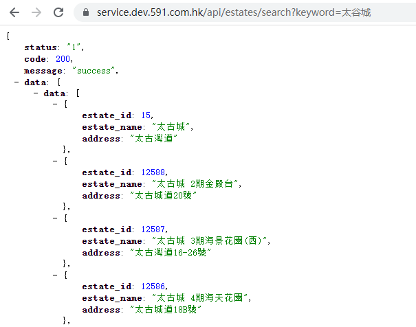
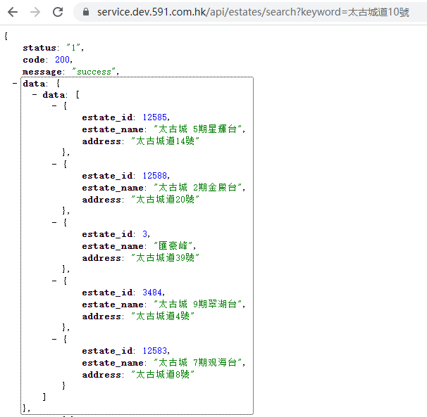

## 定义
现代的搜索引擎，一般会具备“Suggest As You Type"功能，即在用户输入搜索的过程中，进行自动补全或者纠错。通过协助用户输入更精准的关键词，提供后续全文搜索阶段文档匹配程度。
例如，我们在京东上搜索关键字”世界上“，下方会根据我们是搜索内容进行联想匹配，出现的结果就是以”世界上“为前缀的搜索结果。

当输入的文字有个别错误的时候，也可以进行适当的纠错，返回我们预期想要搜索的内容。
例如，我们搜索”平果手机“，出现的匹配内容都是以”苹果手机“为开头的，忽略了个别错别字。

要实现以上的功能，就需要解决以下三个问题：
### 精确率
也叫查准率，这个也是最基本的，返回的结果需要是用户想要看到的。
### 召回率
召回率也叫查全率，少量的字符错误是可以被允许的，提供纠错能力可以提升用户体验，也这样提高召回率，不会发生个别错误字符导致没有结果返回的情况。但是需要注意的是，召回率和查准率是相互制约的，召回率越高会导致精确率降低，需要做出权衡，合理取舍。
### 响应速度
响应速度是很容易被忽略，但事实上是很重要的。响度速度会很直观的影响到用户体验。用户输入内容时，键盘敲击速度是很快的，我们需要根据输入的内容提供结果，响应速度就得跟得上。
## like 模糊查询
使用数据库`like`实现，语法如下：
```sql
select * from table where name like ‘%太古%’ or address ‘%太古%’...
```
使用数据库模糊查询可以实现根据内容返回包含关键字的结果，实现起来非常简单，但是缺点也很明显，主要体现下面两个方面。
### 效率差
不管是使用前缀，中缀还是后缀`like`查询，效率都不尽人意。如果涉及多个字段还需要使用`or`查询。在查询数据量稍微大一点的表，查询速度很难让人接受。
### 召回率低
`like`查询返回的结果必须包含指定的内容，如果有一个字符不匹配，就有可能查询不到结果。也就是说，如果用户输错了一个字符，那下方的搜索建议就会没有内容，用户体验就会变得很差。
### 结论
使用`like`实现自动完成，只限于数据量不大的场景，优点是实现简单。但是要检索的数据量稍微大一点的就不适合了，需要使用其他的替代方案来实现快速检索和提高用户体验。
## Completion Suggester
我们先看下官网对于`Completion Suggester`的介绍：
> The completion suggester provides auto-complete/search-as-you-type functionality. This is a navigational feature to guide users to relevant results as they are typing, improving search precision. It is not meant for spell correction or did-you-mean functionality like the term or phrase suggesters.
> Ideally, auto-complete functionality should be as fast as a user types to provide instant feedback relevant to what a user has already typed in. Hence, completion suggester is optimized for speed. The suggester uses data structures that enable fast lookups, but are costly to build and are stored in-memory.

根据官网的介绍，我们对其进行如下总结：

1. completion suggester 适用于自动完成（补全）的场景，也就是根据用户输入进行前缀匹配。
2. 支持有限的纠错。
3. 速度很快，可以根据用户已经输入的内容即时反馈。
4. 数据存储在内存，并且会进行压缩（压缩比高）。
### Mapping
```json
PUT completion_suggester
{
  "mappings": {
    "properties": {
      "name": {
        "type": "text",
        "analyzer": "ik_max_word",
        "fields": {
          "suggest": {
            "type": "completion",
            "analyzer": "ik_max_word"
          }
        }
      },
      "name_en": {
        "type": "text",
        "analyzer": "ik_max_word",
        "fields": {
          "suggest": {
            "type": "completion",
            "analyzer": "ik_max_word"
          }
        }
      },
      "address": {
        "type": "text",
        "analyzer": "ik_max_word",
        "fields": {
          "suggest": {
            "type": "completion",
            "analyzer": "ik_max_word"
          }
        }
      }
    }
  }
}
```
### 查询
查询语句如下，需要注意的是`fuzzy`会影响纠错能力，需要根据实际情况调整参数设置，以达到最适合的参数设置。
```json
GET completion_suggester/_search
{
  "suggest": {
    "estate_suggest": {
      "prefix": "太古",
      "completion": {
        "size":10,
        "field":"name.suggest",
        "skip_duplicates":true,
        "fuzzy":{
          "fuzziness":3,
          "transpositions": true,
          "min_length":3,
          "prefix_length":1,
          "unicode_aware":true
        }
      }
    }
  }
}
```
### 测试
数据准备完成后，我们可以进行相应的测试，根据输入指定的内容，分析返回的结果和我们的预期是否有较大的偏差，以便我们调整参数设置。
#### 1.输入正确的前缀部分：太古
这种没啥可说的，也是最基本的，效果和`MySQL`中的`like '太古%'`类似，优点是比`like`查询效率高出很多。

#### 2.输入的前缀部分有错误字符：太谷城
用户使用拼音输入法，将`古`错误的输入成`谷`，如果使用`like`在`MySQL`在模糊匹配，必然匹配不到任何内容。
使用`Elasticsearch`的`Completion Suggester`就是实现纠错的功能，返回以`太*城`作为前缀的词条作为用户的联想输入内容，提高用户体验。


#### 3.指定的地址不存在：太古城道10號
指定的地址并不存在，但是通过`fuzzy`设置，就能够返回临近的地址，例如太古城道14號、太古城道20號这些用户可能想看到的。

#### 4.英文名有部分有误：KAM Tan TERRACE
故意在英文名中间输错三个字符，原本是 `KAM DIN TERRACE`，但是经过`fuzzy`纠错设置，也是能给匹配预期的内容的。

### 总结
`completion`类型的数据会存储在内存中，查询速度非常快，因为经过了压缩，也不会特别占用内存。
因为`Elasticsearch`的`completion`类型只支持前缀查询的特性，所以是非常适合用在`auto complete`功能上。并且经过适当的`fuzzy`参数设置，既可以进行纠错，也可以平衡召回率和查准率之间的矛盾。

