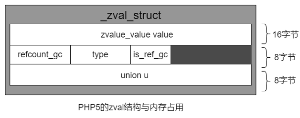
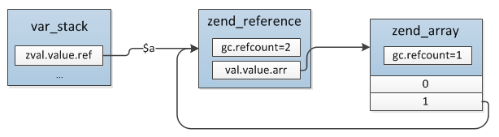
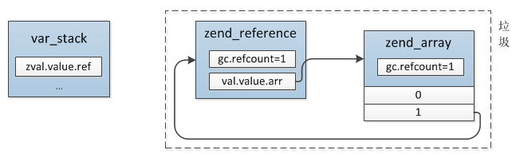
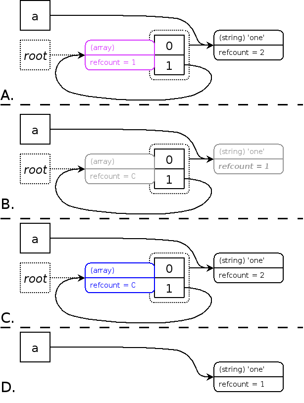
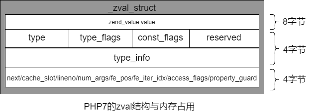

## 概念
PHP本身实现了垃圾回收机制(Garbage Collection)，让程序员不必过分关心程序内存分配，从而将更多的精力投入到业务逻辑。 

PHP中的变量划分为三大类：

1. 标量数据类型
   1. 包括布尔型、整型、浮点型和字符串
2. 复合数据类型。
   1. 包括数组、对象;
3. 特殊数据类型
   1. 包括资源、null

PHP变量的管理基于**引用计数+写时复制**实现的。
## 引用计数
PHP把所有类型变量都存在一个叫 "zval"的变量容器中，变量的内存是通过引用计数进行管理的。
zval变量容器，除了包含变量的类型和值，还包括两个字节的额外信息

1. is_ref
a. bool类型，用来表示变量是否属于引用集合。
1. refcount
a. 表示指向这个zval变量容器的变量个数。

### PHP 5.x
在PHP5中，zval 的内存是单独从堆中分配的，PHP 需要知道哪些 zval 是正在使用的，哪些是需要释放的。所以这就需要用到引用计数来保存zval本身被引用的次数。如果引用计数变成 0，就意味着这个变量已经没有用了，内存也就可以释放了。


#### 标量类型
当一个变量被赋常量值时，就会生成一个zval变量容器。
```php
$a = "hello"; 
xdebug_debug_zval('a');
```
```php
a: 
(refcount=1, is_ref=0),string 'hello' (length=5)
```
这里只有一个变量使用这个变量容器，所以refcount=1。
没有任何自定义的引用， 所以is_ref也是0。

把一个变量赋值给另一变量将增加引用次数。
```php
$a = "hello";
$b = $a;
xdebug_debug_zval('a');
xdebug_debug_zval('b');
$b = "hi";
xdebug_debug_zval('a');
xdebug_debug_zval('b');
```

```php
a:
(refcount=2, is_ref=0),string 'hello' (length=5)
b:
(refcount=2, is_ref=0),string 'hello' (length=5)
a:
(refcount=1, is_ref=0),string 'hello' (length=5)
b:
(refcount=1, is_ref=0),string 'hi' (length=2)
```
当执行 $b=$a时，引用次数是2，因为同一个变量容器被变量a和变量b关联，这时候PHP还没有必要去复制已生成的变量容器。当$b重新赋值时，才会进行内存复制，此时refcount分别都变成1。

传引用后，is_ref会变成1。
```php
$a = "hello";
$b = $a;
xdebug_debug_zval('a');
xdebug_debug_zval('b');
$c = &$a;
$a = "hi";
xdebug_debug_zval('a');
xdebug_debug_zval('b');
xdebug_debug_zval('c');
```
```php
a:
(refcount=2, is_ref=0),string 'hello' (length=5)
b:
(refcount=2, is_ref=0),string 'hello' (length=5)
a:
(refcount=2, is_ref=1),string 'hi' (length=2)
b:
(refcount=1, is_ref=0),string 'hello' (length=5)
c:
(refcount=2, is_ref=1),string 'hi' (length=2)
```
变量a和b开始使用的是同一变量容器。$a传引用给$c后，a,c指向的是同一个变量容器，所以is_ref=1，refcount=2。
b后面使用单独的变量容器，refcount变为1。

当任何关联到某个变量容器的变量离开它的作用域，例如函数执行结束或者对变量执行了unset()，refcount就会减少1,变量容器在refcount变成0时就会被销毁。
```php
$a = "hello";
$c = $b = $a;
$e = &$a;
$a = "hi";
unset($a);
unset($b);
xdebug_debug_zval('a');
xdebug_debug_zval('b');
xdebug_debug_zval('c');
xdebug_debug_zval('e');
```

```php
c:
(refcount=1, is_ref=0),string 'hello' (length=5)
e:
(refcount=1, is_ref=0),string 'hi' (length=2)
```
如果我们再执行unset($c)和unset($e)，那么这两个变量容器就会从内存中删除。
#### 复合类型
array和object类型的变量会把他们的成员或属性存在自己的符号表中。

如下面的例子：
```php
$a = array('name'=>'samuel','age'=>18);
$a['number'] = $a['age'];
xdebug_debug_zval('a');
```
```php
a:
(refcount=1, is_ref=0),
array (size=4)
  'name' => (refcount=1, is_ref=0),string 'samuel' (length=6)
  'age' => (refcount=2, is_ref=0),int 18
  'number' => (refcount=2, is_ref=0),int 18
```
上面会生成四个zval变量容器,分别是a,name,age,number。
我们使用赋值给数组添加元素后，age和number指向同一个zval变量容器，refcount为2。

和标量类型一样，unset会使refcount减1，当refcount减为0时，变量容器会从内存中被删除。
```php
$a = array('name'=>'samuel','age'=>18);
unset($a['age']);
xdebug_debug_zval('a');
```
```php
a:
(refcount=1, is_ref=0),
array (size=1)
  'name' => (refcount=1, is_ref=0),string 'samuel' (length=6)
```

#### 循环引用的问题
PHP变量的回收是根据refcount实现的，当unset、return时会将变量的引用计数减掉，如果refcount减到0则直接释放value，这是变量的简单gc过程。
在PHP 5.3之前的版本中，数组循环引用会出现内存无法回收的问题。
如下：
```php
$a = array( 'one' );
$a[] =& $a;
xdebug_debug_zval( 'a' );
```
```php
a: (refcount=2, is_ref=1)=array (
   0 => (refcount=1, is_ref=0)='one',
   1 => (refcount=2, is_ref=1)=...
)
```
当使用unset($a)后，会发生下面的问题。
```php
(refcount=1, is_ref=1)=array (
   0 => (refcount=1, is_ref=0)='one',
   1 => (refcount=1, is_ref=1)=...
)
```

unset($a)之前的引用关系:

unset($a)之后：  


尽管不再有某个作用域中的任何符号指向这个结构(就是变量容器)，由于数组子元素仍然指向数组本身，所以这个容器不能被清除 。因为没有另外的符号指向它，用户没有办法清除这个结构，结果就会导致**内存泄漏**。
这种无法通过简单的gc机制回收的情况下就会产生垃圾，垃圾回收器要处理的就是这种情况，目前垃圾只会出现在array、object两种类型中。
为了解决这问题，PHP 使用了[循环回收](http://php.net/manual/zh/features.gc.collecting-cycles.php)的方法。当一个 zval 的计数减一时，就有可能属于循环的一部分，这时将 zval 写入到根缓冲区(root buffer)中。当缓冲区满时，潜在的循环会被打上标记并进行回收。
##### 循环回收
是否加入循环回收判断如下：

1. 如果一个zval的refcount增加，说明此zval继续在被使用，不是垃圾。
1. 如果引用计数减少到零，所在变量容器将被正常清除。
1. 如果引用计数减少到非零值时，那么此zval有可能成为垃圾，放入缓冲区，这时才会产生垃圾周期。

当一个zval可能为垃圾时，回收算法会把这个zval放入一个根缓冲区。当缓冲区达到最大临界值时（默认10000），回收算法会循环遍历所有缓冲区中的zval，判断其是否为垃圾，并进行释放处理。
##### 执行步骤
如下：

1. 根据深度优先遍历所有根zval,将每个成员模拟删除,使成员的refcount减1。每个变量只能被模拟删除一次，模拟删除后进行标记。
1. 再次遍历，将引用计数大于0的zval模拟恢复，refcount加1。每个变量也只能恢复一次，恢复后进行标记。为0的保持不变。
1. 销毁所有refcount为0的zval，并收回其内存。

（下面这个图是PHP文档上抄的，看了半天没明天灰色的refcount =C 是啥回事，后面发现应该是O才对，估计没印好，不知道PHP文档上哪里抄来的图）

##### 核心原理
这个算法的原理很简单，垃圾是由于成员引用自身导致的，那么就对所有的成员减一遍引用，如果发现最后变量本身的 refcount 变为了 0 则就表明其引用全部来自自身成员，即其他任何地方都不再使用它，那么它就是垃圾，需要被回收掉。
如果你这个变量不是垃圾，那么它的所有成员变量的引用减一之后，refcount 必然不为0，需要将其从缓冲区移出去。
当垃圾回收机制打开时，每当根缓存区存满时，就会执行上面描述的循环查找算法。通过此方法解决循环引用的问题，可以将内存泄漏保持在一个阀值以下。
### PHP 7.x
在PHP7中，zval使用了新的实现方式，更改了内存分配和引用计数的存储方式。
不同的数据类型与PHP 5.x相比，引用计数的计算上也出现了一些差别。
简单数据类型（比如整形和浮点类型）也不需要计数；
这样可以节省大量的内存分配和内存管理等操做，从而性能获得很大的提高。


（以下案例是在PHP7.1.23下的结果，PHP7的各个版本不同会有会有一定的差异）
#### 整形和浮点类型
```php
$var_int = 123;
$var_float = 1.23;
$var_int2 = $var_int;
$var_float2 = $var_float;
xdebug_debug_zval('var_int');
xdebug_debug_zval('var_float');
xdebug_debug_zval('var_int2');
xdebug_debug_zval('var_float2');
```
```php
var_int:
(refcount=0, is_ref=0)int 123
var_float:
(refcount=0, is_ref=0)float 1.23
var_int2:
(refcount=0, is_ref=0)int 123
var_float2:
(refcount=0, is_ref=0)float 1.23
```
在为int和float的类型的变量名申请zval_struct时，可以直接将变量的值存储到zval_struct.value中，对于这种简单的类型，就不会在对它们进行引用计数，而是拷贝的时候就直接赋值。这样就省掉了大量的引用计数相关的操作。

当然对于那种根本没有值, 只有类型的类型, 也不需要引用计数了:

1. IS_NULL
1. IS_FALSE
1. IS_TRUE

#### 普通字符串类型
```php
$var_string = "abc".time();
xdebug_debug_zval('var_string');
$var_string2 = $var_string;
xdebug_debug_zval('var_string');
```

```php
var_string:
(refcount=1, is_ref=0)string 'abc1629256042' (length=13)
var_string:
(refcount=2, is_ref=0)string 'abc1629256042' (length=13)
```
普通字符串和PHP5的版本的计数是一样的。
#### 静态字符串类型
```php
$var_string = "abc";
xdebug_debug_zval('var_string');
$var_string2 = $var_string;
xdebug_debug_zval('var_string');
```

```php
var_string:
(refcount=2, is_ref=0)string 'abc' (length=3)
var_string:
(refcount=3, is_ref=0)string 'abc' (length=3)
```

#### 数组
```php
$var_arr = [1,2.1,'abc'];
xdebug_debug_zval('var_arr');
$var_arr2 = $var_arr;
xdebug_debug_zval('var_arr');
exit;
```
```php
var_arr:
(refcount=2, is_ref=0)
array (size=3)
  0 => (refcount=0, is_ref=0)int 1
  1 => (refcount=0, is_ref=0)float 2.1
  2 => (refcount=1, is_ref=0)string 'abc' (length=3)
var_arr:
(refcount=3, is_ref=0)
array (size=3)
  0 => (refcount=0, is_ref=0)int 1
  1 => (refcount=0, is_ref=0)float 2.1
  2 => (refcount=1, is_ref=0)string 'abc' (length=3)
```
 immutable array （不可变数组），在不可变数组和静态字符串下，初始使用一个伪计数值2。
我们可以尝试将数组元素改成可变的
```php
$var_arr = [1,2.1,time()];
xdebug_debug_zval('var_arr');
exit;
```
```php
var_arr:
(refcount=1, is_ref=0)
array (size=3)
  0 => (refcount=0, is_ref=0)int 1
  1 => (refcount=0, is_ref=0)float 2.1
  2 => (refcount=0, is_ref=0)int 1629254030
```

可变数组和PHP5的数字计数也是一样的。
## 写时复制
对于多个引用来说，zaval 只有在没有变化的情况下才是共享的，一旦其中一个引用改变 zval 的值，就需要复制一份 zval，然后修改复制后的 zval。
写时复制的机制在计算机系统中有非常广的应用，它只有在必要的时候(写)才会发生硬拷贝，可以很好的提高效率。
通过一个简单的例子来说明:
```php
$a = 10;
$b = $c = $a;
xdebug_debug_zval('a');
xdebug_debug_zval('b');
xdebug_debug_zval('c');
$a = 20;
xdebug_debug_zval('a');
xdebug_debug_zval('b');
xdebug_debug_zval('c');
```
```php
a:
(refcount=3, is_ref=0),int 10
b:
(refcount=3, is_ref=0),int 10
c:
(refcount=3, is_ref=0),int 10
a:
(refcount=1, is_ref=0),int 20
b:
(refcount=2, is_ref=0),int 10
c:
(refcount=2, is_ref=0),int 10
```
第一步变量a传值给变量b,c值都为10，a,b,c共享同一个zval变量容器，引用次数是3。
第二步当变量a重新赋值后，a复制了一分zval，refcount为1。剩下的b和c共享一个，引用次数refcount为2。

可以看到，再值不变的情况，PHP是没有必要进行复制zval变量容器的。只有值变化时，共享的变量容器才会进行复制。
## 参考

- [引用计数基本知识](https://www.php.net/manual/zh/features.gc.refcounting-basics.php)
- [回收周期](https://www.php.net/manual/zh/features.gc.collecting-cycles.php)
- [变量的内部实现](https://github.com/pangudashu/php7-internal/blob/master/2/zval.md)

