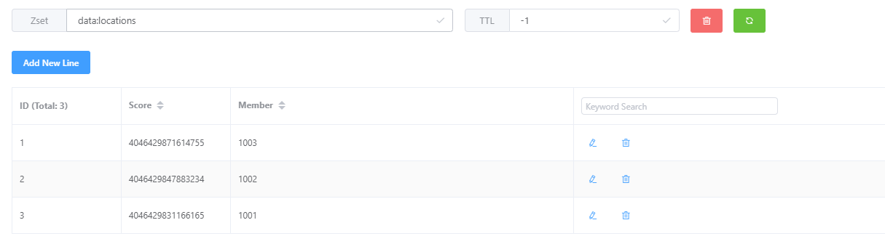
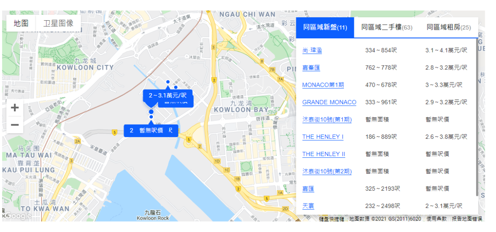

+++
author = "week three"
title = "基于Redis GEO实现的LBS功能"
date = "2021-03-09"
description = "GEO是Redis 3.2 版本中新增的专门面向LBS应用的一种数据类型。使用它我们可以非常方便的实现一些基于位置信息服务(Location-Based Service,LBS)的应用。"
categories = [
    "redis"
]
tags = [
    "redis"
]
image = "113958-153525479855be.jpg"
+++


## 介绍
Redis除了5大基本数据类型：String、List、Hash、Set和Sorted Set。还提供了3种拓展数据类型，分别是Bitmap、HyperLogLog和GEO。

GEO是Redis 3.2 版本中新增的专门面向LBS应用的一种数据类型。使用它我们可以非常方便的实现一些**基于位置信息服务(Location-Based Service,LBS)**的应用。例如打车软件获得离用户最近的车辆信息。或者根据用户点阅的物件展示周边距离最近的物件。利用GEO和经纬度信息可以很简单的获取到数据。

## 如何使用

### 数据存储Redis
使用前，需要将经纬度数据准备好，使用以下命令存储到Redis中。
```shell
GEOADD key longitude latitude member [longitude latitude member ...]
```
例如，物件ID是1001的经纬度信息为114.143701,22.408597
```shell
GEOADD data:locations 114.143701 22.408597 1001 
```
将所有数据插入到Redis后，我们就可以开始获取想要的数据了。
### 获取范围内的数据

#### 根据经纬度
例如，我们想根据经纬度获得离它5km范围最近的三笔数据，按距离由近到远排序。
```shell
> GEORADIUS data:locations 114.152801 22.411597 5 km ASC COUNT 3
1003
1001
1002
```
返回的数据就是按直线距离排序好的成员ID。其中参数`5 km`就是限制距离范围。支持多种单位长度

- m表中单位为米
- km表示千米
- mi表示英里
- ft表示为英尺

#### 根据已有成员
也可以直接根据已有成员的经纬度获得数据
```shell
> GEORADIUSBYMEMBER  data:locations 1001 5 km ASC COUNT 3 WITHDIST WITHCOORD
1001
0.0000
114.14370328187942505
22.40859655827627961
1002
1.1170
114.14270013570785522
22.41859603324986239
1003
1.4382
114.15269941091537476
22.41849717912464968
```
这里我们是直接根据已有成员的经纬度获得的数据，输入的参数是成员的ID。
其中通过增加参数获得额外的信息

- WITHDIST	返回与给定目标的直线距离
- WITHCOORD	返回经纬度信息

需要注意的是，ID为1001的自身也会一并返回。
### 计算距离
根据两个成员计算距离
```shell
> GEODIST data:locations 1001 1002 m
1116.9774
```
返回的结果为1116.9774，单位为米，同样的，可以通过参数指定单位。
和手写的计算距离的函数对比一下结果。
```php
$lng1 = 114.14370328187942505;
$lat1 = 22.40859655827627961;
$lng2 = 114.14270013570785522;
$lat2 = 22.41859603324986239;

//将角度转为狐度
$radLat1 = deg2rad($lat1);//deg2rad()函数将角度转换为弧度
$radLat2 = deg2rad($lat2);
$radLng1 = deg2rad($lng1);
$radLng2 = deg2rad($lng2);
$a = $radLat1 - $radLat2;
$b = $radLng1 - $radLng2;
$s = round((2 * asin(sqrt(pow(sin($a / 2), 2) + cos($radLat1) * cos($radLat2) * pow(sin($b / 2),2))) * 6378.137) * 1000);
echo $s;
```
返回结果为`1118`米。
## 实现原理
 GEO 类型是把经纬度所在的区间编码作为 Sorted Set 中元素的权重分数，把和经纬度相关的 ID 作为 Sorted Set 中元素本身的值保存下来，本质上还是使用了有序集合存储数据。 这样相邻经纬度的查询就可以通过编码值的大小范围查询来实现了。   
为了能高效地对经纬度进行比较，Redis 采用了业界广泛使用的 GeoHash 编码方法。
GeoHash的编码实现的方法有点复杂，有兴趣的可以自行研究。
 

## 使用场景
利用GEO类型，可以很方便的获得计算距离的数据
 

还有这种按距离由近及远取周边物件的。
 

