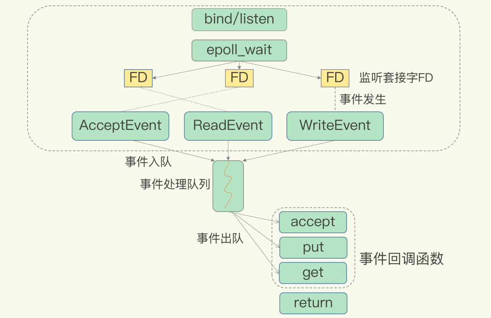
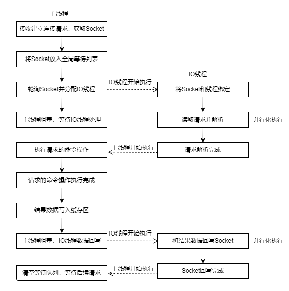

+++
author = "week three"
title = "Redis 6.0新特性"
date = "2021-11-09"
description = "早在去年5月，Redis 6.0 的稳定版就已经发布。到今天为止，最新稳定版已经到6.2.6了。我们来看一下，Redis 6.0有哪些值得关注的新特性。"
categories = [
    "redis"
]
tags = [
    "redis"
]
draft = false
image = "1.jpg"
+++

## IO 多线程
Redis 一直被大家熟知的就是它的单线程架构，虽然有些命令操作可以用后台线程或子进程执行（比如数据删除、快照生成、AOF 重写），但是，从网络 IO 处理到实际的读写命令处理，都是由单个线程完成的。

在 6.0 版本之前，Redis采用了采用了多路 I/O 复用技术，这里的多路指的是多个 socket 网络连接，复用指的是复用同一个线程。通过多路 I/O 复用技术在同一个线程中处理多个 I/O 请求，尽量减少网络 I/O 的消耗，提升使用效率。

但随着网络硬件的性能提升，Redis的性能瓶颈有时会出现在网络 IO 的处理上，单个主线程处理网络请求的速度跟不上底层网络硬件的速度。

在 6.0 版本中，Redis把请求网络包读写和解析也从主线程中剥离出来了。

**Redis 6.0 采用多个 IO 线程来处理网络请求，提高网络请求处理的并行度。但是对于读写命令，仍然使用单线程来处理。**

这样实现有两个好处：

1. 通过多个IO线程并行处理网络操作，解决网络处理瓶颈提升实例的整体处理性能。
1. 读写命令继续使用单线程处理，可以避免上下文切换和不必要的线程之间引起的资源竞争，线程模型更简单。
<a name="kkgdh"></a>
### 处理流程
主线程和多 IO 线程的协作主要分成以下几个阶段：

1. 服务端和客户端建立 Socket 连接，并分配处理线程。
1. IO 线程读取并解析请求。
1. 主线程执行请求操作。
1. IO线程回写 Socket 和主线程清空全局队列

在第2、4阶段，由于加入了 IO 多线程，多个 IO 线程并行处理读取与解析请求，以及回写 Socket 的操作都会很快。因此可以加速网络处理，进而提升实例的吞吐量。

### 开启多线程
默认情况下，多线程是关闭的。如果需要启动，要在 `redis.conf` 进行以下配置。
```shell
#启用多线程
io-threads-do-reads yes

#设置线程个数
io-threads  6
```
需要注意的是，线程个数要小于实例所在的 CPU 核个数。对于 8 核 CPU 的机器，官方建议配置 6 个 IO 线程。
<a name="e9ZJW"></a>
## 权限控制
在 Redis 6.0 版本之前，只能通过创建一个密码来进行安全控制。只要知道密码，就能执行类似 `KEYS、FLUSHDB、FLUSHALL` 等各种危险的操作。

Redis 6.0 提供了更加细粒度的访问权限控制。
> 升级到 6.0 版本后，配置文件只设置了密码，客户端登录的时候是需要指定默认用户名`default`。

<a name="FJEFR"></a>
### 创建不同用户
Redis 6.0 版本之前所有使用者通过一个密码登陆使用，没有账号的概念。而在 Redis 6.0 可以通过使用 `ACL SETUSER` 给使用者创建不同的用户账号。
```shell
#创建并启用samuel账号，密码为123
ACL SETUSER samuel on >123
```
<a name="pUo5g"></a>
### 根据命令操作设置访问权限
Redis 6.0 支持以用户为粒度设置命令操作的访问权限。<br />例如：
```shell
#给用户 samuel 开启 get 操作的权限。
ACL SETUSER samuel +get
```
<a name="NM7PA"></a>
### 根据类型设置访问权限
也可以根据不同的数据类型来给用户授权<br />例如：
```shell
#限制用户只能操作 Hash 类的命令，不能调用 String 类型的命令
ACL SETUSER samuel +@hash -@string
```
<a name="yeg5p"></a>
### 根据key设置访问权限
使用波浪号 "~" 和 key 的前缀来表示访问控制的 key。<br />例如：
```shell
#设置用户 samuel 只能对以 "user:" 为前缀的 key 进行命令操作
ACL SETUSER samuel ~user:* +@all

#设置用户 samuel 可以进行所有操作
ACL SETUSER samuel ~* +@all
```
Redis 6.0 可以创建不同用户来访问实例，而且可以基于用户和 key 的粒度，设置某个用户对某些 key 允许或禁止执行的命令操作。

这样一来，我们在有多用户的 Redis 应用场景下，就可以非常方便和灵活地为不同用户设置不同级别的命令操作权限，这对于提供安全的 Redis 访问非常有帮助。

| 操作 | 作用 |
| --- | --- |
| +<command> | 将一个命令添加到用户可以调用的命令列表中 |
| -<command> | 将一个命令从用户可以调用的命令列表中移除 |
| +@<category> | 将一类命令添加到用户可以调用的命令列表中 |
| -@<category> | 将一类命令从用户可以调用的命令列表中移除 |
| +@all | 允许调用所有的命令操作 |
| -@all | 禁止调用所有命令操作 |

<a name="Zg960"></a>
## 客户端缓存
Redis 6.0 新增了跟踪 （Tracking）功能，也就是实现了服务端协助的客户端缓存，业务应用中 Redis 客户端可以把读取的数据缓存在业务应用本地了，应用就可以直接在本地快速读取数据了。

Tracking 功能通过下面两种模式，来解决客户端对已缓存但失效的数据同步处理。
<a name="Q9n6o"></a>
### 普通模式
这种模式下，实例会在客户端记录客户端读取过的 key，并检测 key 是否有修改。一旦 key 的值发生变化，服务端会给客户端发送 invalidate 消息。通知客户端缓存失效，客户端下次请求就需要从服务端获取最新数据。

通过以下命令开启或关闭普通模式下 Tracking 功能。
```shell
CLIENT TRACKING ON|OFF
```
需要注意的是，为了节省服务端的内存空间，对于客户端不再访问的 key ，服务端是不会记录这个 key 的修改情况的。就算是之前已经发送过 invalidate 消息的key，如果此后客户端没有再次执行读命令。之后这个 key 再被修改，服务端就不会再次给客户端发送 invalidate 消息。

总结：Server 端全局唯一的表（Invalidation Table）记录每个Client访问的Key，当发生变更时，向client推送数据过期消息。

- 优点：只对Client发送其访问过的被修改的数据
- 缺点：Server端需要额外存储较大的数据量
<a name="SGvr6"></a>
### 广播模式
这种模式下，服务端会给客户端广播所有 key 的失效情况。

为了防止 key 在频繁修改的情况下，服务端发送大量失效广播消息造成大量网络带宽资源被消耗。客户端需要跟踪指定前缀的 key，这样让服务端针对性的发送失效信息给客户端。
```shell
CLIENT TRACKING ON BCAST PREFIX user
```
类似上面的命令操作。只有更新了 user: 前缀的key，客户端才会收到 invalidate 消息。<br />和普通模式不同，就算客户端还没有读取过 key，只要注册了跟踪前缀，服务端就会把这个 key 失效消息通知给客户端。

总结：客户端订阅 key 前缀的广播，服务端记录 key 前缀与 client 的对应关系。当相匹配的 key 发生变化时通知 client

- 优点：服务端记录信息比较少
- 缺点：client 会收到自己未访问过的 key 的失效通知
<a name="VekFS"></a>
## RESP3 协议
RESP（Redis Serialization Protocol）是 Redis 服务端与客户端之间通信的协议。RES P协议在Redis 1.2中引入，在Redis 2.0中成为与Redis服务器通信的标准方式。而 Redis 6 开始在兼容 RESP2 的基础上，开始支持 RESP3。

推出 RESP3 的目的：一是因为希望能为客户端提供更多的语义化响应，以开发使用旧协议难以实现的功能；另一个原因就是为了实现上面提到的客户端缓存功能功能。
<a name="X2iuj"></a>
## 总结
面向网络处理的多 IO 线程可以提高网络请求处理的速度，而客户端缓存可以让应用直接在客户端本地读取数据，这两个特性可以提升 Redis 的性能。

除此之外，细粒度权限控制让 Redis 可以按照命令粒度控制不同用户的访问权限，加强了 Redis 的安全保护。RESP 3 协议则增强客户端的功能，可以让应用更加方便地使用 Redis 的不同数据类型。
<a name="YsFbc"></a>
## 参考

1. 极客时间《Redis 核心技术与实战》- 蒋德钧